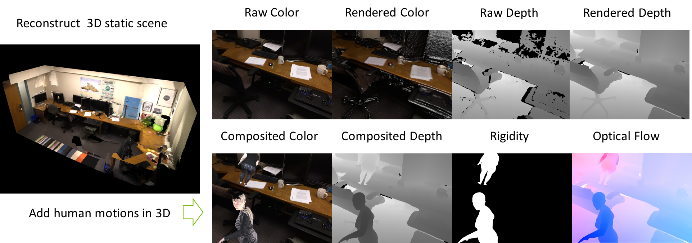

# RefRESH Toolkit in Blender

## Summary

The blender toolkit for **REal 3D from REconstruction with Synthetic Humans (RefRESH)**. 

  

[Video Example of the Created Data][6] | [Project Page][8]

If you use this code or our generated dataset, please cite the following paper:

**Learning Rigidity in Dynamic Scenes with a Moving Camera for 3D Motion Field Estimation**,
*Zhaoyang Lv, Kihwan Kim, Alejandro Troccoli, Deqing Sun, James M. Rehg, Jan Kautz*, 
European Conference on Computer Vision 2018, [ArXiv Preprint][7]

```bibtex
@inproceedings{Lv18eccv,  
  title     = {Learning Rigidity in Dynamic Scenes with a Moving Camera for 3D Motion Field Estimation},  
  author    = {Lv, Zhaoyang and Kim, Kihwan and Troccoli, Alejandro and Rehg, James and Kautz, Jan},  
  booktitle = {ECCV},  
  year      = {2018}  
}
```

### Contact: 

Zhaoyang Lv: lvzhaoyang1990@gmail.com

### Contents 

* [Dependencies](https://github.com/lvzhaoyang/RefRESH#dependencies)
* [Prepare 3D static data](https://github.com/lvzhaoyang/RefRESH#prepare-the-3d-static-scene-datasets)
* [Prepare 3D dynamic data](https://github.com/lvzhaoyang/RefRESH#prepare-your-synthetic-humans)
* [Run Blender Instructions](./blender/README.md)
* [License](https://github.com/lvzhaoyang/RefRESH#license)
* [Download existing data (Soon)](https://github.com/lvzhaoyang/RefRESH#download-the-created-refresh-dataset)
* [Acknowledgement](https://github.com/lvzhaoyang/RefRESH#acknowledgement)

### Note: 

* We currently only support loading BundleFusion RGB-D sequences and meshes. Loading different sequences and meshes may result in a change in data loading protocol. Feel free to contribute. 

* All codes are tested by Zhaoyang on linux machines and servers. For any other systems, there is no guarantee how to run it and I have no devices to reproduce the relevant issues. 

* Although the rendering code is automatically batch run as we wish, it can still be slow on a single machine. Please consider use a server with multiple CPU cores to do that. 

* There are some small changes after the paper submission to make the rendering process much easier to run and we change the rendering output to the multichannel OpenEXR format. In this way we also generate two pass flow, rather than one in the original data. Please let me know if it generates unexpected results. 

* Currently there is no strict roadmap about how to extend this toolkit, although I might add functionalities to support different foreground objects, more background meshes, only if there is a research need. 

## Dependencies

### Install Blender

We need blender which has OSL support for rendering (Do not use ubuntu default blender (2.76), which does not have full support for Open Shading Language).
[Download the blender][1] (2.79 version we tested) and set the blender path

``` bash
BLENDER_PYTHON=~/develop/blender-2.79b/2.79/python
alias blender_python=$BLENDER_PYTHON/bin/python3.5m

curl https://bootstrap.pypa.io/get-pip.py -o get-pip.py
$BLENDER_PYTHON/bin/python3.5m get-pip.py

alias blender_pip=$BLENDER_PYTHON/bin/pip3
# install the python dependencies for blender python  
blender_pip install -r setup/blender_requirements.txt
```

### Install system dependencies

``` bash
sudo apt-get install openexr
sudo apt-get install libopenexr-dev
```

### Set the python environment 

We have already created the conda environment for all the dependencies:

``` bash
conda env create -f setup/conda_environment.yml
```

## Prepare the 3D static scene datasets

Our dataset creation strategy is not limited to any particular 3D reconstruction dataset. In this paper, we use the scenes reconstructed from [BundleFusion][4] project only as an example. 

Create a symbolic link for all the target files in the data folder named `RefRESH`:

```
mkdir data
ln -s $BUNDLE_FUSION data/RefFRESH
```

### Download [BundleFusion][4]

Download all the reconstructed scenes and source files from [their website][4]:
```bash
# Change the destinationn in the script file if you want to use a different location.
sh setup/download_BundleFusion.sh
```
Run the bundlefusion utility script to generate the bundle fusion pickle files.
```bash
python miscs/process_bundlefusion.py
```
Similarly, we will also generate the pickle files for all relevant data so that we can more easily accesss in all different projects.

## Prepare your synthetic humans 

### SMPL data

In the smpl_data/README.md, you should finally see all the items in the list.

#### Download SMPL for MAYA

You need to download SMPL for MAYA from the [official website(click here)][3] in order to run the synthetic data generation code. Once you agree on SMPL license terms and have access to downloads, you will have the following two files:

```
basicModel_f_lbs_10_207_0_v1.0.2.fbx
basicModel_m_lbs_10_207_0_v1.0.2.fbx
```

Place these two files under `smpl_data` folder.

#### Download SMPL textures and other relevant data

With the same credentials as with the SURREAL dataset and within the `smpl_data` folder, you can download the remaining necessary SMPL data. All the downloaded files should be placed within the same directory:

``` shell
cd smpl_data
./download_smpl_data.sh /path/to/smpl_data yourusername yourpassword
```

For a more detailed instructions specifically for this dataset, please refer to smpl_data/README.md.

### Ready to run

To create your dataset with the blender toolkit, please refer to [./blender/README](./blender/README.md) 

## License

MIT License

Copyright (c) 2018 Zhaoyang Lv

Permission is hereby granted, free of charge, to any person obtaining a copy
of this software and associated documentation files (the "Software"), to deal
in the Software without restriction, including without limitation the rights
to use, copy, modify, merge, publish, distribute, sublicense, and/or sell
copies of the Software, and to permit persons to whom the Software is
furnished to do so, subject to the following conditions:

The above copyright notice and this permission notice shall be included in all
copies or substantial portions of the Software.

THE SOFTWARE IS PROVIDED "AS IS", WITHOUT WARRANTY OF ANY KIND, EXPRESS OR
IMPLIED, INCLUDING BUT NOT LIMITED TO THE WARRANTIES OF MERCHANTABILITY,
FITNESS FOR A PARTICULAR PURPOSE AND NONINFRINGEMENT. IN NO EVENT SHALL THE
AUTHORS OR COPYRIGHT HOLDERS BE LIABLE FOR ANY CLAIM, DAMAGES OR OTHER
LIABILITY, WHETHER IN AN ACTION OF CONTRACT, TORT OR OTHERWISE, ARISING FROM,
OUT OF OR IN CONNECTION WITH THE SOFTWARE OR THE USE OR OTHER DEALINGS IN THE
SOFTWARE.

## Download the created RefRESH dataset

We are currently working how to host the dataset. It will be available soon. 

## Acknowledgement 

Our work can not be done without the precedent research efforts. Part of the human rendering code is refactored on top of the [SURREAL][5] toolkit. 

[1]: http://download.blender.org/release/
[2]: https://launchpad.net/~thomas-schiex/+archive/ubuntu/blender
[3]: http://smpl.is.tue.mpg.de
[4]: http://graphics.stanford.edu/projects/bundlefusion/
[5]: https://github.com/gulvarol/surreal
[6]: https://youtu.be/MnTHkOCY790?t=3m5s
[7]: https://arxiv.org/abs/1804.04259
[8]: https://github.com/NVlabs/learningrigidity